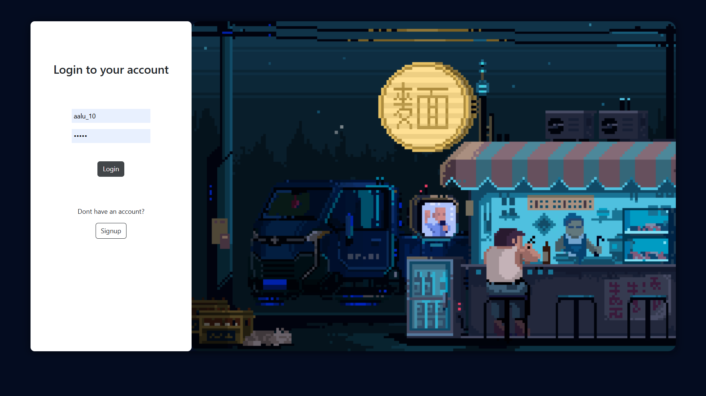

# Minted - A Decentralised NFT Marketplace



## Overview

Minted is a fully decentralized NFT marketplace developed as a major project by Prajjwal Kushwaha in November 2022. The platform enables users to mint, buy, and sell NFTs with zero transaction costs, ensuring transparency, security, and ownership integrity.&#8203;:contentReference[oaicite:2]{index=2}

## Features

- **Decentralized Storage**: :contentReference[oaicite:3]{index=3}&#8203;:contentReference[oaicite:4]{index=4}
- **Unique NFT Identification**: :contentReference[oaicite:5]{index=5}&#8203;:contentReference[oaicite:6]{index=6}
- **User-Friendly Interface**: :contentReference[oaicite:7]{index=7}&#8203;:contentReference[oaicite:8]{index=8}
- **Enhanced Security**: :contentReference[oaicite:9]{index=9}&#8203;:contentReference[oaicite:10]{index=10}

## Technologies Used

- :contentReference[oaicite:11]{index=11}&#8203;:contentReference[oaicite:12]{index=12}
- :contentReference[oaicite:13]{index=13}&#8203;:contentReference[oaicite:14]{index=14}

## Getting Started

To set up the project locally:

1. **Clone the repository**:

   ```bash
   git clone https://github.com/yourusername/minted-nft-marketplace.git
   ```
